 

<picture>
  <source media="(prefers-color-scheme: dark)" srcset="./output/assets/svg/typing-dark.svg">
  <source media="(prefers-color-scheme: light)" srcset="./output/assets/svg/typing-light.svg">
  
</picture>

  <picture>
    <source media="(prefers-color-scheme: dark)" srcset="./output/assets/svg/overview-dark.svg">
    <source media="(prefers-color-scheme: light)" srcset="./output/assets/svg/overview-light.svg">
    
  </picture>
  <picture>
    <source media="(prefers-color-scheme: dark)" srcset="./output/assets/svg/heatmap-dark.svg">
    <source media="(prefers-color-scheme: light)" srcset="./output/assets/svg/heatmap-light.svg">
    
  </picture>

<picture>
  <source media="(prefers-color-scheme: dark)" srcset="./output/assets/svg/charts-dark.svg">
  <source media="(prefers-color-scheme: light)" srcset="./output/assets/svg/charts-light.svg">
  
</picture>

 

---

  Auto-generated daily via <a href="https://github.com/soranjiro/soranjiro/actions">GitHub Actions</a>
  · Powered by <strong>GitHub Copilot SDK</strong> &amp; GitHub GraphQL API
  · Last updated: 2026-03-09

