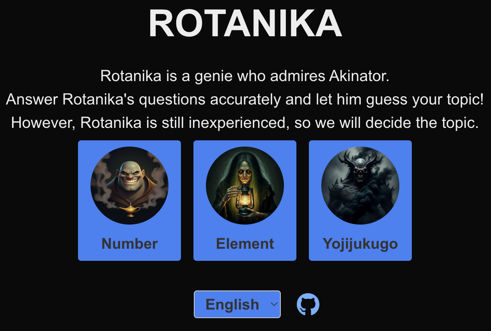

 <h1 align="center">Hello World</h1>

<!-- 

    
    

    
    

 -->

# Wanna play a game?

<!-- # My Skill (Programming Languages, Frameworks and Tools)

  ※Another skill and tools
  Codeigniter, Virtual Box, CakePHP, CircleCI and so on. -->

# NOW TRAINING

   

 

    <h1>
        ・・
        ・・
        ・・・・
        ・
        ・・・・
    </h1>

   
